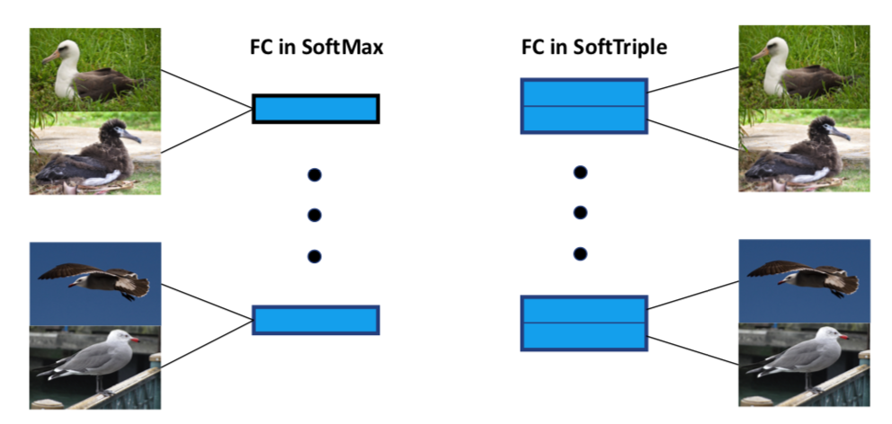
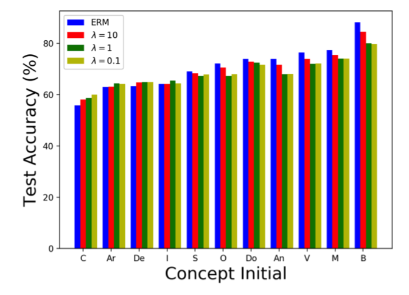
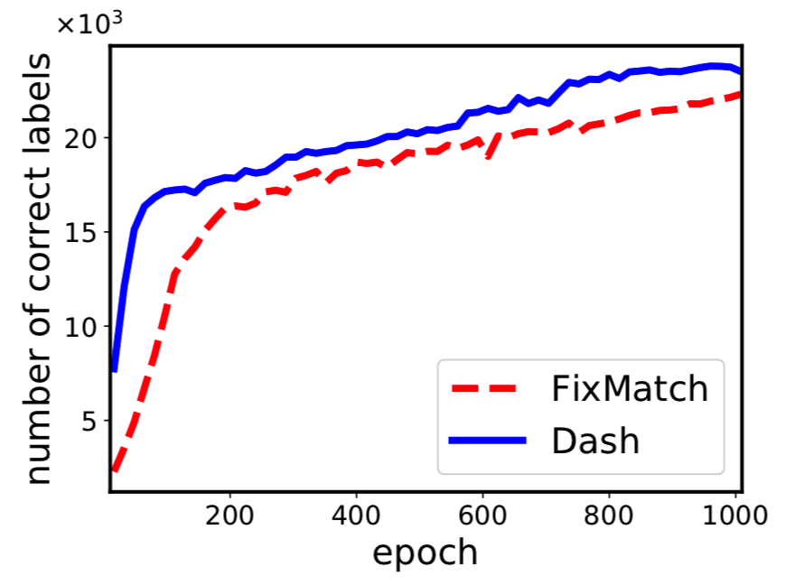
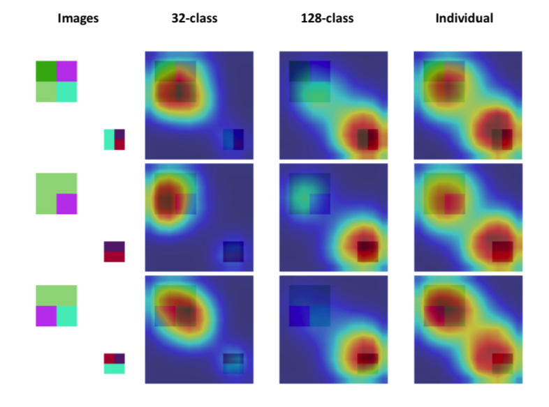
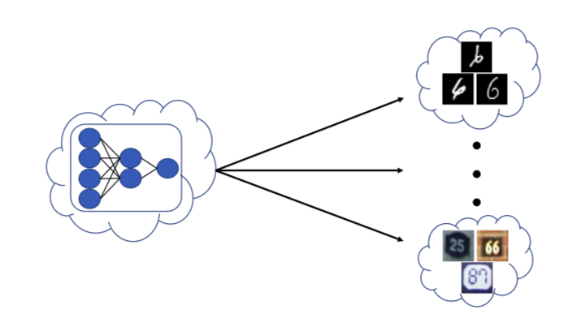
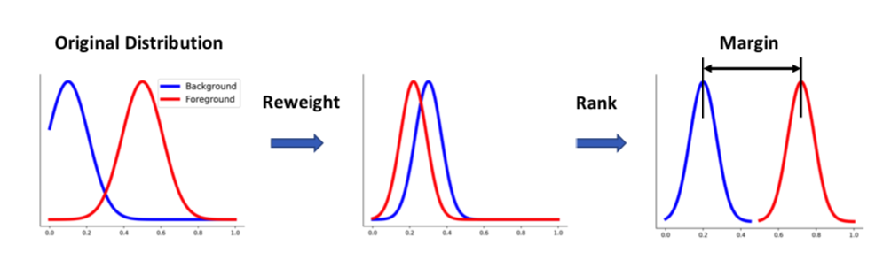

# Machine Learning in Computer Vision

## **1. Representation Learning/Distance Metric Learning**

### _Large-scale Distance Metric Learning with Uncertainty.[CVPR'18]_ [pdf](https://arxiv.org/pdf/1805.10384.pdf) 

We show that representations can be optimized with triplets defined on multiple centers of each class rather than original examples.

### _SoftTriple Loss: Deep Metric Learning Without Triplet Sampling.[ICCV'19]_ [pdf](https://arxiv.org/pdf/1909.05235.pdf) [code](https://github.com/idstcv/SoftTriple)

We show that the conventional cross entropy loss with normalized softmax operator is equivalent to a triplet loss defined on proxies from classes. Based on the analysis, an improved loss encoding multiple proxies for each class is proposed.

### _Hierarchically Robust Representation Learning.[CVPR'20]_ [pdf](https://arxiv.org/pdf/1911.04047.pdf) [resource](http://qi-qian.com/codes/imagenet_concepts.txt)

We propose an algorithm to balance the performance of different classes in the source domain for pre-training. A balanced model can be better for fine-tuning on a different domain.

## **2. Learning with Limited Supervision**

### _Dash: Semi-Supervised Learning with Dynamic Thresholding.[ICML'21]_ [pdf](http://proceedings.mlr.press/v139/xu21e/xu21e.pdf) 

We propose a novel thresholding strategy to pick the appropriate unlabeled data for semi-supervised learning.

### _Weakly Supervised Representation Learning with Coarse Labels.[ICCV'21]_ [pdf](https://arxiv.org/pdf/2005.09681.pdf) [code](https://github.com/idstcv/CoIns)

We show that representations learned by deep learning is closely related to the training task. With coarse labels only, it is possible to approach the performance with full supervision.

## **3. Robust Optimization**

### _Robust Optimization over Multiple Domains.[AAAI'19]_ [pdf](http://qi-qian.com/papers/aaai19.pdf) 

Given examples from multiple domains, we propose an algorithm to optimize the worst domain effectively.

### _DR Loss: Improving Object Detection by Distributional Ranking.[CVPR'20]._ [pdf](https://arxiv.org/pdf/1907.10156.pdf) [code](https://github.com/idstcv/DR_loss)

To tackle the imbalance issue in object detection, we convert the classification problem to a ranking problem and propose a novel loss accordingly.

[back](./)
